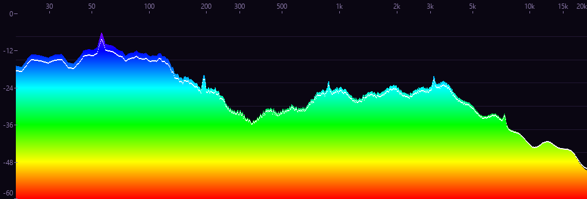

# 本项目使用Deepseek实现

# 频谱可视化 · foo_spectrum

给 foobar2000 用的频谱面板。最多 1024 段，颜色、渐变、刻度位置都能自己配，帧率上限 240。

## 预览

**经典配色**（默认）—— 三色垂直渐变，每根柱子从下往上绿→黄→红，顶上那条白线是峰值保持。


**刻度与网格** —— 频率轴在下方、电平轴在左侧，dB 刻度与柱顶严格对齐。


**彩虹渐变** —— 频率轴挪到上方，1024 段，刻度位置和配色都可以换。



**低频放大** —— 频率范围填 20–200 Hz，256 根柱子全部用来画低频。


## 安装

1. 打开参数设置
2. 左边选「组件」
3. 点「安装…」，选中 `foo_spectrum.fb2k-component`
4. 列表里会出现「频谱可视化 (Spectrum Visualizer)」，标着需要重启
5. 点「应用」，按提示重启 foobar2000

升级也一样，直接「安装…」选新版本覆盖即可，不用先卸载，也不用自己找目录。

## 打开面板

菜单 `视图 → 可视化 → 频谱可视化`。双击全屏。

想让它常驻成一块面板：`视图 → 布局 → 启用布局编辑模式`，右键一个面板选
`替换 UI 元素…`，再选「频谱可视化」。

面板上单击右键有三个入口：

- `设置面板…` —— 分析、显示、柱体动态、刻度
- `颜色设置…` —— 所有配色相关的操作
- `高级设置…` —— 跳到 `参数设置 → 高级` 里对应的分支

## 配色


调好的配色可以存成自定义预设（最多 32 个，留空名字会自动叫「配色 N」）。
内置 7 组：`经典绿`（下绿→中黄→上红）、`深海蓝`、`落日火焰`、`彩虹`、`霓虹紫`、
`琥珀示波器`、`黑白`。

## 配置文件

设置面板底部的「导出配置…」会把全部设置写成一份 `.ini`：

```ini
bands=256
fps=60
bar_fall_ms=90
freq_min=20
freq_max=20000
scale_freq=1
color.background=0A0E12
color.bar_low=00B000
color.bar_high=FF2000
```

能直接手改、能进版本管理、能发给别人。导入时：没写到的项保持当前值，越界值自动收到
合法范围，`fft=0` 表示自动，颜色支持 `RRGGBB` / `#RRGGBB` / 三位缩写，
`;` 和 `#` 开头是注释。
