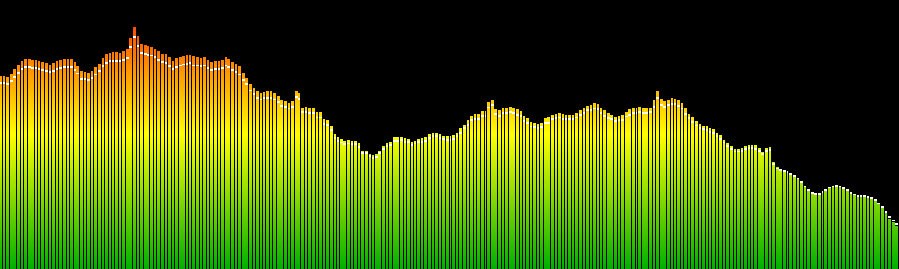
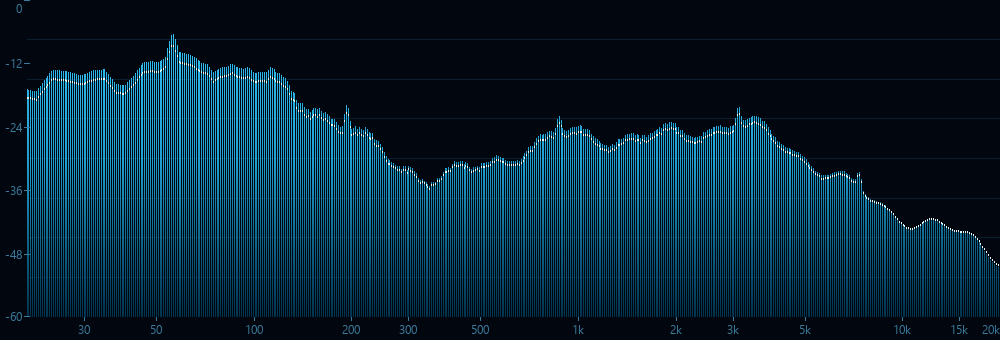
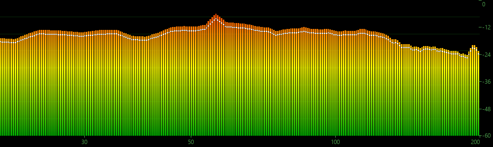
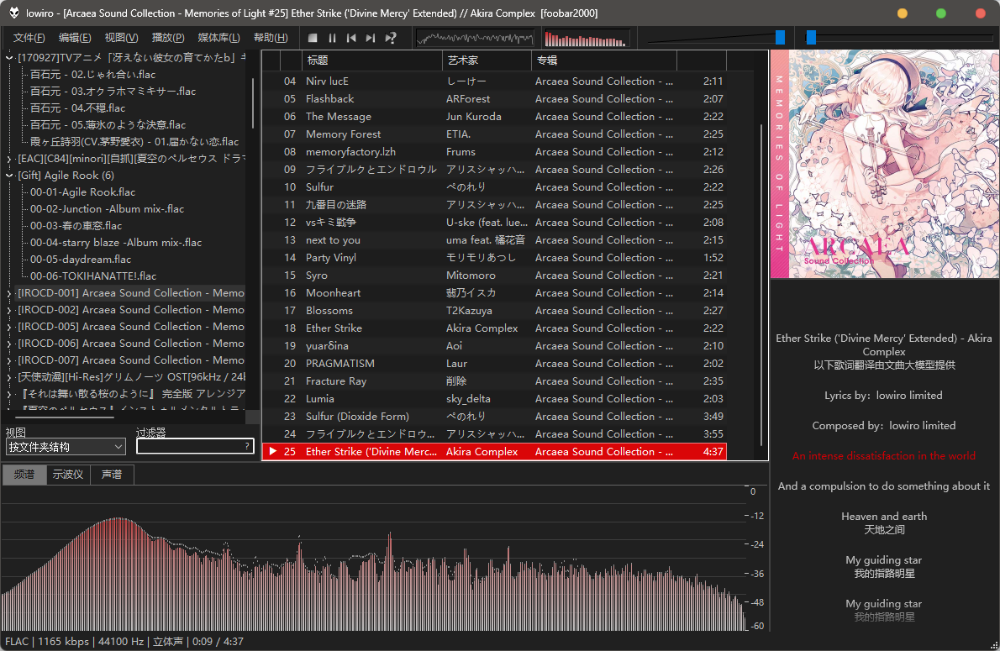

# 本项目使用Deepseek实现

# 频谱可视化 · foo_spectrum

foobar2000 的频谱面板。最多 1024 段，渐变、颜色、刻度位置都能自己配，帧率上限 240。
500 Hz 以下单独走一路 16384 点长窗 FFT，低频不会糊成一片。

    

## 安装

参数设置（`Ctrl+P`）→ 组件 → 安装… → 选中 `.fb2k-component` → 应用 → 按提示重启。

不能双击安装：foobar2000 默认不注册 `.fb2k-component` 关联，双击多半被解压软件接走。
升级同理，直接安装覆盖，不用先卸载。

## 使用

菜单 `视图 → 可视化 → 频谱可视化`，双击全屏。想让它常驻成面板：启用布局编辑模式后
右键面板 → `替换 UI 元素…` → 选「频谱可视化」。

面板右键三项：`设置面板…`（分析 / 显示 / 柱体动态 / 刻度）、`颜色设置…`、`高级设置…`。

## 设置

设置面板里每项鼠标悬停都有详细说明。默认值：

| 设置 | 默认 | 设置 | 默认 |
| --- | --- | --- | --- |
| 波段数量 | 256（64–1024） | 刷新率 | 60 FPS |
| FFT 点数 | 自动 | 上升 / 下落时间 | 0 / 90 ms |
| 频率范围 | 20–20000 Hz | 峰值下落 | 60 %/s |
| 显示样式 | 柱状 + 峰值保持 | 增益 | 100 % |
| 渐变 | 三色，垂直 | 频谱倾斜 | 0 dB/oct |
| 低频增强 | 开 | 网格 / 频率刻度 / 电平刻度 | 关 |

**频谱倾斜**：以 1 kHz 为轴心、每倍频程抬高或压低多少 dB（−12 ~ +12）。音乐能量天然
每倍频程衰减约 6 dB，所以高频柱子天生就矮——填正值把高频抬起来整条曲线就平了。
它和「增益」不是一回事：增益是全频段统一乘，改不了斜率。实用范围约 ±6。

**频率上下限**不是把区间外留空，而是把选中的区间放大铺满整个面板。

## 配色与外观预设

面板右键 → `颜色设置…`。色块旁边标着用途；取色方式可在系统调色板和屏幕吸管之间切换。

内置 7 组**配色**预设：经典绿 / 深海蓝 / 落日火焰 / 彩虹 / 霓虹紫 / 琥珀示波器 / 黑白。

自定义预设存的是**整套外观**（最多 32 个）：颜色、显示样式、不透明度、柱间空隙、渐变、
dB 刻度、对数轴、网格、两个刻度的位置、频谱倾斜。老版本存的预设仍然可用，只是仍按配色套用。

## 配置文件

设置面板底部可以把整份设置导出 / 导入成 `.ini` 文本，方便备份和分享。
没写到的项保持当前值，越界值自动收敛到合法范围。
